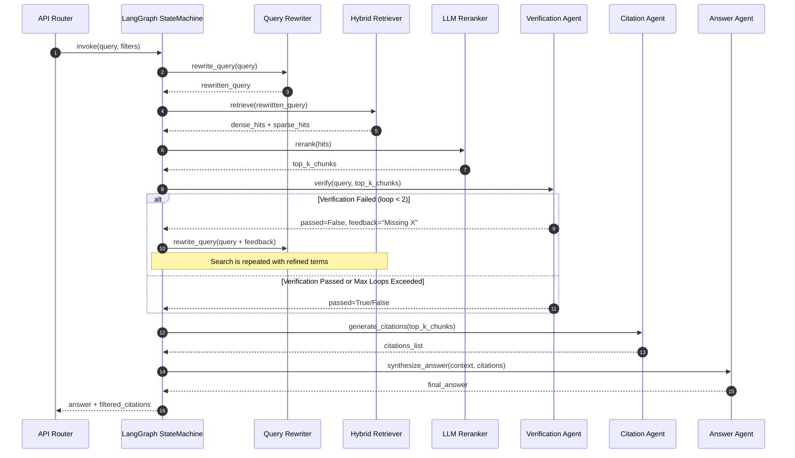

# System Architecture: Enterprise AI Knowledge Assistant

This document details the architectural blueprint of the **Enterprise AI Knowledge Assistant**, a production-grade multi-agent RAG platform.

## 1. Business Problem
Enterprises struggle with information silos across fragmented document formats (PDFs, Word files, presentations, and spreadsheets). Standard keyword searches fail to capture semantic intent, while naive RAG systems suffer from hallucinations, lack of source citations, and irrelevant context aggregation, leading to distrust in AI-assisted decisions.

## 2. Design Rationale
Our architecture adopts a decoupled, event-driven service topology combining:
1. **FastAPI Services** for synchronous document APIs, conversational generation, and metadata lookups.
2. **PostgreSQL** as the single source of truth for file inventory, parsing states, structured metadata, and SLA quality logs.
3. **Qdrant** as a high-performance, filterable vector search engine.
4. **LangGraph State Machine** for query expansion, iterative verification loops, and citation formatting.

## 3. Multi-Agent Sequence Flow
The graph runs an iterative loop to ensure factuality before generation:

## 4. Engineering Tradeoffs
* **LangGraph vs. Sequential Chains:** LangGraph allows backward loops (e.g., repeating search after query rewriting if verification fails). This increases latency for failed searches but guarantees high precision.
* **SQLite/Postgres Dual Setup:** We use SQLAlchemy with PostgreSQL for production and in-memory SQLite for rapid, isolated unit testing, bypassing environment setup bottlenecks during local development.

## 5. Scalability Considerations
* **Horizontal Scaling:** FastAPI and Streamlit are stateless and can be scaled horizontally using Kubernetes HPA.
* **Vector Indexing:** Qdrant collections use partition keys matching `department` to restrict search spaces to specific shards, avoiding full-index scans.

## 6. Failure Scenarios
* **Qdrant Timeout:** If Qdrant is unreachable, the system falls back fully to Postgres-based sparse keyword searches (BM25) to maintain platform availability.
* **LLM Rate Limits:** LangGraph nodes implement exponential backoff retry mechanisms to handle HTTP 429 exceptions gracefully.

## 7. Future Improvements
* **Async Task Queue:** Transition from FastAPI BackgroundTasks to Celery/RabbitMQ to manage high-volume concurrent PDF parsing pipelines.
* **Self-hosted Embeddings:** Deploy `bge-small-en-v1.5` on Triton Inference Server to eliminate dependency on OpenAI embedding network requests.
