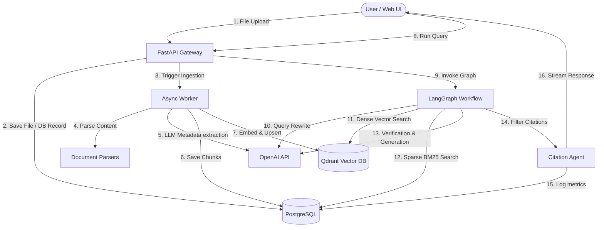

# System Architecture: Enterprise AI Knowledge Assistant

This document details the architectural blueprint of the **Enterprise AI Knowledge Assistant**, a production-grade multi-agent RAG platform.

## 1. Business Problem & Requirements
Enterprise environments demand high accuracy, auditability, and data security. Standard semantic retrieval setups run into:
- **Context Pollution:** Feeding non-relevant pages into LLMs, degrading response quality.
- **Hallucinations:** The generator presenting plausible-sounding but completely fabricated data.
- **Verification Gaps:** Users cannot easily confirm where the data originated.

Our system addresses these concerns through a modular, decoupled architecture centered around an agentic state-machine workflow.

---

## 2. Component Topology

The system comprises the following components:
1. **Frontend (Streamlit):** Web UI allowing users to manage files, trigger query runs, view citations, and inspect system SLA metrics.
2. **Gateway (FastAPI):** Exposes JSON API endpoints and orchestrates the background parsing thread.
3. **Database (PostgreSQL / SQLite):** Single source of truth for document schemas, chunk text mappings, and SLA evaluation logs.
4. **Vector DB (Qdrant):** Houses dense embeddings for fast similarity checks.
5. **State Orchestrator (LangGraph):** Manages query-expansion and self-correction search loops.



---

## 3. LangGraph Orchestration & Agent State

The orchestration engine leverages `langgraph` to run a stateful cyclic graph. The node execution is governed by `AgentState`:

```python
class AgentState(TypedDict):
    query: str                       # User's raw input query
    rewritten_query: str             # Query expanded/contextualized by QueryRewriterAgent
    filters: Optional[Dict[str, Any]] # Search boundaries (e.g. department, tags)
    chat_history: Optional[List[Dict[str, str]]] # Prior dialog context
    retrieved_chunks: List[Dict[str, Any]]  # Raw hybrid search hits
    reranked_chunks: List[Dict[str, Any]]   # Top-scored chunks selected by RerankerAgent
    citations: List[Dict[str, Any]]         # Mapped source annotations
    verification_passed: bool        # Flag indicating if context suffices for the query
    verification_feedback: str       # Reason for failure (fed back to rewriter)
    answer: str                      # Final synthesized response text
    loop_count: int                  # Retries tracker (capped at 2)
```

### Agent Nodes Execution Flow
1. **`rewrite_query`**: Analyzes the raw query and historical chat logs. If verification failed on the previous iteration, it incorporates `verification_feedback` to expand search terms.
2. **`retrieve`**: Invokes the `VectorStoreService` to perform hybrid dense-sparse search, passing metadata filters.
3. **`rerank`**: Utilizes an LLM scoring prompt to check which chunks directly solve the user's question, sorting them and pruning irrelevant ones (scores < 2.0).
4. **`verify`**: Evaluates whether the top chunks provide enough factual information. If not, sets `verification_passed = False` and loops back up to `rewrite_query`.
5. **`generate_citations`**: Assigns bracketed IDs to relevant chunks and maps them to metadata (filename, page/row numbers).
6. **`generate_answer`**: Synthesizes the final response incorporating inline citation references.

---

## 4. Engineering Tradeoffs

- **Cyclic Agentic Search vs. Fixed Pipeline:** Cyclic search loops add latency (up to 2-3 seconds per loop) but drastically improve precision, filtering out false-positive contexts and preventing hallucinations.
- **Relational Databases for Chunks:** Storing chunk text inside a relational database (rather than just Qdrant payload) allows transactional stability, precise BM25 counts, and easy join queries for comparison matrices.
- **In-Memory Rate Limiting:** The in-memory rate-limiter is chosen for zero-dependency local runs. Horizontally scaled containers should swap the dictionary store for a Redis instance.

---

## 5. Failure Management & Scalability

- **API Limits / Backoffs:** The OpenAI API connection implements exponential backoff retry loops to prevent crashes due to HTTP 429 (Rate Limit Exceeded) errors.
- **Vector Sharding:** Qdrant collections can use `department` as a payload routing key, directing queries only to relevant shards.
- **Offline Fallback:** If Qdrant experiences downtime, the system fails over to PostgreSQL sparse matching (`BM25Okapi` over database chunks) to maintain liveness.
